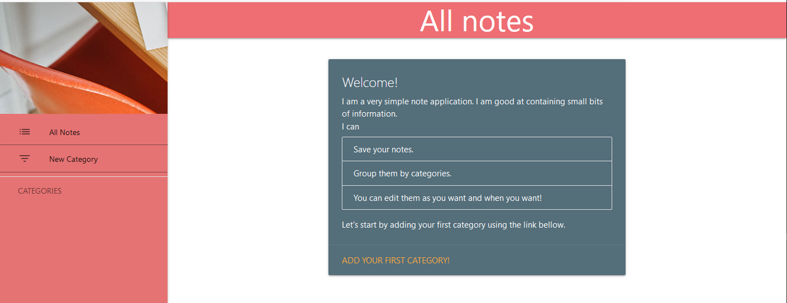

Simple Note Taking App
======================

## Description
A simple note taking application using `Django 3.0.5`.

## Features
* Add, edit and delete notes.
* Add, edit and delete categories.
* Each note contains title, category, content and creation date.
* Home page display all notes.
* Sidebar with a categories tree.
* Category page to display its information and all notes linked to it.
* Note page to display note information.
* Notification messages.
* Using Materialize CSS Framework https://materializecss.com for UI design.

## Architecture

### Models
The following diagram shows the models structure, each category has `title` and `creation date` and linked to many notes, 
and each note linked to one category and has `title`, `content` and `creation date`.


### ModelForm
The file `note/forms.py` contains NoteForm and CategoryForm, they are responsible of handling the creation and updating
requests and define the fields to display for each model.

### Views
The file `note/views.py` contains all functions required to display application interfaces.
Every function prepare the request information with the context variables to render one template, html file.

### Templates
They are located inside `note/templates` folder, and it contains the following folders:
* `note/templates/note` folder contains note pages templates.
* `note/templates/category` folder contains note pages templates.

All templates extends the base template `base.html`, and use Materialize CSS components like `Sidebar`, `Navbar`, `Select` input and CSS classes.

## Usage
### Requirements
* Python 3.7
### Installation
```
python manage.py -r requirements.txt
python manage.py makemigrations note
python manage.py migrate note
python manage.py collectstatic
```
### Run
```
python manage.py runserver
```
## Screenshots

### Welcome


### New Category


### New Note


### All Notes


### Notes by category


### Note page


